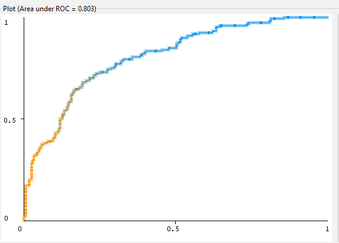

```{r setup, include=FALSE}
knitr::opts_chunk$set(echo = TRUE)
```

\centering

\raggedright

\clearpage

\tableofcontents

\newpage


```{r, echo=FALSE, include=FALSE}
library(ggplot2) 
library(tidyverse)
library(scales)
library(gplots)
library(corrplot)
library(plyr)
library(factoextra)
library(knitr)
```


# Cirrhosis prediction

## The dataset
The dataset consists of 424 Primary biliary cholangitis patients who where on a trial for D-penicillamine which was placebo controlled. 
312 of the instances contain complete data as these patients have participated the trial, the remaining individuals did not participate in the trial but consented to have basic measurements taken.

### Loading the data
Reading the data used for the project.
```{r}
data <- read.csv("./data/cirrhosis.csv")
```

### Codebook
```{r}
codebook <- read.csv("./data/codebook.csv", header = T, sep = ";", row.names = 1)
kable(codebook)
```

## Research question

"Can the stage of cirrhosis be determined with basic measurements and non-invasive testing of the blood and urine using machine learning?". 

### Setup of the project
For this project we constructed a machine-learning (ML) algorithm that tries to determine the stage, and thus the severity of cirrhosis in PBC patients. This will involve supervised learning where the class variable is the stage of the disease


## Data exploration and preprocessing


### Basic statistics


### Numeric data


### Summary


First off we will create a summary for all numeric attributes to have a look at their distribution.
```{r}
summary(data[,c(2,5,11,12:19)])
```

We notice a lot of missing values due to a large number of patients not being involved in the whole screening but just provided basic measurements.
The extend to which these missing values will influence the accuracy of the model to be produced is large when about twenty percent of the patients miss a value.
For that reason the choice has been made to for the time being not remove any instances based on missing values.

### Log transformation

If we look at the summaries we see differences between maximum- and mean values in the order of hundreds. Therefore, to reduce the amount of skewness, it is wise to log-transform the data to make our analysis more valid.

```{r}
data[,c(11,12:19)] <- log(data[,c(11,12:19)])
```

### Normilization

To compare the numeric attributes with each other we first have to normalize the data, we do this by scaling.
The boxplot below shows all the normalized numeric values in comparison to each other.

```{r}
data[,c(11,12:19)] <- lapply(data[,c(11,12:19)], scale)
```

### Distribution of numeric attributes


```{r}
boxplot(data[,c(11,12:19)], las = 2, col = hue_pal()(20),outpch = 25, outbg = hue_pal()(20), cex.axis = 0.7, xlab = "Attributes", ylab = "Scaled values (log)", main = "Distribution of numeric attributes")
```


We see a number off nummbers that remain skewed with either outliers on the left or right side of the distribution.
The albumin and platelet attributes seem to be skewed to the left and the alkaline phosphate and prothrombin attributes seem to be skewed to the right eventhough the data has been logscaled.
This does not mean the data is of less quality, we hope for an scenario in which these outliers may help catagorize the patients in the cirrhosis stages.

### Nominal data

To get a sense of the nominal attributes data we create a barplot for all types.


```{r, echo=FALSE, out.width="45%"}
barplot(table(data$Drug), col = hue_pal()(20), ylab = "Number of instances", xlab = "Type of drug", main = "Number of instances on drug type")
barplot(table(data$Sex), col = hue_pal()(20), ylab = "Number of instances", xlab = "gender", main = "Gender of the participants")
barplot(table(data$Ascites), col = hue_pal()(20), ylab = "Number of instances", xlab = "Yes or No", main = "presence of ascites")
barplot(table(data$Hepatomegaly), col = hue_pal()(20), ylab = "Number of instances", xlab = "Yes or No", main = "presence of hepatomegaly")
barplot(table(data$Spiders), col = hue_pal()(20), ylab = "Number of instances", xlab = "Yes or No", main = "presence of spider veins")
barplot(table(data$Edema), col = hue_pal()(20), ylab = "Number of instances", xlab = "Yes or No or S", main = "presence of edema")
```

The plots that draw our attention are the ones that have a big difference in the number of instances between groups.
We notice that the patient pool primarily consist of women, and that most of the patients do not suffer from ascites or edema. 
As expected the difference between patients on placebo and the actual drug is about the same, just as the distribution of patients that suffer from hepatomegaly.


### Correlations


#### Protthrombin time and the prevalence of ascites
From the literature we can derive that a prolonged prothrombin time is a useful value to identify the prevalence of ascites.
Therefore we plot the prothrombin time against the the presence of ascites in a violin plot.

```{r, echo=FALSE}
ggplot(data = na.omit(data)) +
  aes(x = Prothrombin, y = Ascites)  + geom_violin()  + geom_jitter()+ ggtitle("Prothrombin time in patients with of without ascites") + xlab("Prothrombin time")
```

We see that the patients who are not diagnosed with ascites tend to have a lower prothrombin time then their diagnosed counterparts.
But we also see a lot of instances of patients with no ascites in the range of patients with ascites.
This is due to the two samples being very unequal (see fig [num]), therefore we preform a welch t-test to see whether the difference is significant.

```{r}
t.test(subset(data, Ascites == "Y", select = Prothrombin), subset(data, Ascites == "N", select = Prothrombin))
```

From the output we can see that the t test-statistic is 5.8423 and the corresponding p-value is 3.358e-06.
Since this p-value is less than .05, we can reject the null hypothesis and conclude that there is a statistically significant difference in mean scores between the two groups.
So the prothrombin time might be an useful indicator of the presence of acsites and then maybe even in our model for determining the stage of cirrhosis.

### Copper and D-penicillamine


The D-penicillamine drug is a chelating agents, meaning it binds heavy metals making it possible to excrete them through urine.
To see whether the drug affects the concentration of copper in urine we plotted the copper concentration against the time between registration and analysis.

```{r, echo=FALSE}
real <- subset(data,data$Drug == "D-penicillamine", select = c(N_Days, Copper) )
placebo <- subset(data,data$Drug == "Placebo", select = c(N_Days, Copper) )
ggplot(real, aes(x=N_Days, y=Copper)) + geom_point() + geom_smooth(method="auto", se=TRUE, fullrange=FALSE, level=0.95) + ggtitle("Copper concentration in urine in D-penicillamine group")
ggplot(placebo, aes(x=N_Days, y=Copper)) + geom_point() + geom_smooth(method="auto", se=TRUE, fullrange=FALSE, level=0.95) + ggtitle("Copper concentration in urine in placebo group")
```

Although the data points are a bit scattered the trend seems to follow a very similar line.
This is useful information because if it were to affect the concentration it might create a bias in our ML model.

### Ascites and edema

```{r, echo=FALSE}
ct <-table(data$Ascites, data$Edema, dnn=c("Ascites","Edema"))
chi_s <- chisq.test(ct)
chi_s
corrplot(chi_s$residuals, is.cor = FALSE, method = 'circle', addgrid.col = 'white', addCoef.col = 'white', cl.pos = 'b', title = "Ascites(y) in relation toEdema(x)" )
```


The plot above shows the relationship between the presence of ascites (plotted on the x-axis) and the presence of edema.
When a number is below zero it means the values repel, they tend not to occur in the same instance.
The opposite is true for positive numbers, these values do tend to occur together.
Most noticeable is the big blue ball in the bottom right.
This means when fluid builds up in the peritoneal cavity in PBC patients it usually means fluid also builds up in other parts in the body, causing edema.
This is most prevalent in edema patients who did not react to treatment with diuretics.
We can draw the same conclusions from the chi-squared test, returning us a p-value smaller than 2.2e-16.


### Class variables

### Missing class variables

Since the project uses supervised learning techniques, the rows without a class variable, eg: NA's, serve no purpose for training the algorithm and can thus be removed.

```{r}
sum(is.na(data$Stage)) #checking the amount of na's in the stage collumn
data <- data[!is.na(data$Stage),] #drop the rows with no class variable
```

We identified six rows with no class variable, exactly as the description of the dataset noted. 
We removed the six instances.

### Distribution of class variables


```{r, echo=FALSE}
barplot(table(data$Stage), col = hue_pal()(20), ylab = "Number of instances", xlab = "Stage of cirrhosis", main = "Distribution of target variables")
```


Because early stage cirrhosis is very hard to diagnose there are significantly less patients labeled with stage one compared to the other stages.
Ideally we would like for all the stages to have about the same amount of instances, the level to which the model will be affected by the skewed data remains to be seen.

### Significant differences between attributes


### Copper 


```{r, echo=FALSE}
boxplot(data$Copper ~ data$Stage, col = hue_pal()(20),outpch = 25, outbg = hue_pal()(20), cex.axis = 0.7, xlab = "Stages of cirhosis", ylab = "Copper concentration (log)", main = "Copper concentration in urine by stage")
res <- aov(Copper ~ factor(Stage), data = na.omit(data))
summary(res)
TukeyHSD(res)
```


Except for the first stage, copper concentrations tend to increase as the cirrhosis progresses.
If we look at the adjusted p-values from our anova and the following Tukey multiple pairwise-comparison, we see significant differences in all except the first two.
The analysis factors in the differences of sample sizes, but because the early stage of cirrhosis is hard to diagnose this amount of data might be insufficient.


### Bilirubin


```{r, echo=FALSE}
boxplot(data$Bilirubin ~ data$Stage, col = hue_pal()(20),outpch = 25, outbg = hue_pal()(20), cex.axis = 0.7, xlab = "Stage of cirhosis", ylab = "Bilirubin concentration (log)", main = "Bilirubin concentration in the blood by stage")
res <- aov(Bilirubin ~ factor(Stage), data = na.omit(data))
summary(res)
TukeyHSD(res)
```


Bilirubin concentrations also increase with the progress of the hepatic disease.
We again notice the first stage only showing significant differences with the fourth stage.
But the overall pattern is more distinct and lets us to believe this is a meaningfull correlation.


### Hepatomegaly


```{r, echo=FALSE}
ct <-table(data$Stage, data$Hepatomegaly, dnn=c("Stage","Hepatomegaly"))
chi_s <- chisq.test(ct)
chi_s
ct <- as.data.frame(ct)
ggplot(ct, aes( fill=Hepatomegaly, y=Freq, x=Stage)) + geom_bar(position="stack", stat="identity") + ggtitle("Presence of hepatomegaly per cirrhosis stage") +
  ylab("Frequency")
```

The relationship between hepatomegaly and the stage of cirrhosis is very clear, hepatomegaly becomes more prevalent as you go up the stages.
It is makes sense that the liver enlarges while it is scarring, therefore almost all the patients in the last stage of cirrhosis experience swelling of the liver.
The chi-squared test confirms with a value of 2.349e-15, far below the bar of significance at 0.05.


### Spider veins

```{r, echo=FALSE}
ct <-table(data$Stage, data$Spiders, dnn=c("Stage","Spiders"))
chi_s <- chisq.test(ct)
chi_s
ct <- as.data.frame(ct)
ggplot(ct, aes( fill=Spiders, y=Freq, x=Stage)) + geom_bar(position="stack", stat="identity")+ ggtitle("Presence of spider veins per cirrhosis stage") +
  ylab("Frequency")
```

Although not as apparent as hepatomegaly, the frequency in which spider veins occur also increases as cirrhosis progresses.
Here nearly half of the patients in stage four cirrhosis experience spider veins, where only a handful experiences them in the first stage.
Again a very low p-value from the chi-squared test at 3.644e-06.


### Clustering analysis


We will preform a k-means clustering on all the numerical data to see if it cat already be categorized in a meaningful way.
Before we will we can do the actual clustering we need to determine the amount of clusters we want to divide the data into.

### Determining amount of clusters 


```{r, echo=FALSE}
fviz_nbclust(na.omit(data[11:19]), kmeans,
  nstart = 25,
  method = "gap_stat",
  nboot = 500 # reduce it for lower computation time (but less precise results)
) +
  labs(subtitle = "Gap statistic method")
```

To determine the amount of clusters we used the gap statistic method, the highest value suggest the amount we should choose.
We see a peak at two, this means we should choose two clusters

### Clustering and visualization


```{r, echo=FALSE}
km <- kmeans(na.omit(data[11:19]), centers = 2, nstart = 25)
fviz_cluster(km, data = na.omit(data[11:19]))
```


```{r, echo=FALSE}
cluster_inst <- as.data.frame( as.matrix(km$cluster))
cluster_inst[2] <- rownames(cluster_inst)

temp <- c()
x<-1
while(x <= nrow(cluster_inst)){
  temp <- append(temp, data[x,20])
  x <- x+1
}
cluster_inst[3] <- temp
cluster_inst <- cluster_inst[order(cluster_inst$V1),]

cluster_inst <-as.data.frame( table(cluster_inst$V1, cluster_inst$V3))

ggplot(cluster_inst, aes(fill=Var1, y=Freq, x=Var2)) + 
    geom_bar(position="stack", stat="identity") + ggtitle("Number of instances per cluster per stage") +
  ylab("Frequency") + xlab("Stage") + labs(fill = "cluster")
```

In the first plot we see the clusters and the respective instances plotted.
It is hard to draw conclusions from these kinds of plots, but we do see minimal overlap and therefore distinct groups.
Looking at the clusters plotted against the different stages in a barplot, we see no obvious correlation between the two.
So we can conclude the k-means clustering of the nemeric variables alone cannot give an indication of the stage of cirrhosis


```{r, echo=FALSE}
# data <- read.csv("./data/cirrhosis.csv")
# data <- data[!is.na(data$Stage),]
data <- data [,2:20]
write.table(data, "C:/Users/keimp/Cirrhosis_Prediction/data/data_eda.csv", sep = ",", na = "", row.names = F)
```


## ML model comparison

```{r, echo=FALSE}
comparison <- read.csv("./data/test_results/comparison_results.csv", sep=";")
rownames(comparison) <- comparison[,1]
comparison[,1] <- NULL
kable(comparison)
```

```{r, echo=FALSE}
comparison_numeric <- read.csv("./data/test_results/comparison_results_numeric.csv", sep=";")
rownames(comparison_numeric) <- comparison_numeric[,1]
comparison_numeric[,1] <- NULL
comparison_numeric <- t(comparison_numeric)
comparison_numeric <- as.data.frame( comparison_numeric)

ggplot(data=comparison_numeric, aes(x=rownames(comparison_numeric), y=percent_correct, fill=rownames(comparison_numeric))) +
  geom_bar(stat="identity") + theme(axis.text.x = element_blank()) + scale_fill_manual(values=c(hue_pal()(20)), name = "ML models") + geom_hline(yintercept = comparison_numeric[1,1], linetype = "dashed") + xlab("ML models") + ggtitle("Percent correct of different machine learning algorithms")
```

```{r, echo=FALSE}
ggplot(data=comparison_numeric, aes(x=rownames(comparison_numeric), y=area_under_roc, fill=rownames(comparison_numeric))) +
  geom_bar(stat="identity") + theme(axis.text.x = element_blank()) + scale_fill_manual(values=c(hue_pal()(20)), name = "ML models") + geom_hline(yintercept = comparison_numeric[1,2], linetype = "dashed") + xlab("ML models") + ggtitle("Area under roc of different machine learning algorithms")
```


### Naive bayes

Comparison of different Naïve bayes algorithms.

```{r, echo=FALSE}
bayes_comparison <- read.csv("./data/test_results/bayes_comparison.csv", sep=";")
rownames(bayes_comparison) <- bayes_comparison[,1]
bayes_comparison[,1] <- NULL
kable(bayes_comparison)
```
no significant difference

```{r, echo=FALSE}
bayes_meta_comparison <- read.csv("./data/test_results/bayes_meta_comparison.csv", sep=";")
rownames(bayes_meta_comparison) <- bayes_meta_comparison[,1]
bayes_meta_comparison[,1] <- NULL
kable(bayes_meta_comparison)
```


### SMO


```{r, echo=FALSE}
smo_meta_comparison <- read.csv("./data/test_results/smo_meta_comparison.csv", sep=";")
rownames(smo_meta_comparison) <- smo_meta_comparison[,1]
smo_meta_comparison[,1] <- NULL
kable(smo_meta_comparison)
```


### Random forest


```{r, echo=FALSE}
rf_meta_comparison <- read.csv("./data/test_results/rf_meta_comparison.csv", sep=";")
rownames(rf_meta_comparison) <- rf_meta_comparison[,1]
rf_meta_comparison[,1] <- NULL
kable(rf_meta_comparison)
```


### Simple logistic


```{r, echo=FALSE}
sl_meta_comparison <- read.csv("./data/test_results/sl_meta_comparison.csv", sep=";")
rownames(sl_meta_comparison) <- sl_meta_comparison[,1]
sl_meta_comparison[,1] <- NULL
kable(sl_meta_comparison)
```


### Choice
We choose to build upon the naïve bayes algorithm.
It shows the highest area under the roc and has the second highest percent correct of all the algorithms.
Furthermore, none of the meta learners seem to create a significant increase in accuracy.

But the percent correct is really not what is it expected to be.
The discrepancy between the area under the roc and the percent correct is explained by the fact that the weka
gui by default only show the roc of the last class label.
Therefore we will transform the dataset where there will be two class labels, yes and no.
Referring to whether cirrhosis is present or not.
We do this because determining the exact stage of pbc will be unfeasible with this dataset.

We read the data again, log-transform it and delete the ID and state attributes.
We do not have to normalize the data again since we wont be comparing it anymore.
Then we alter the class attribute.


```{r, echo=FALSE}
data_single_class <- read.csv("./data/cirrhosis.csv")
data_single_class <- data_single_class[,2:20]
data_single_class <- subset(data_single_class, select = -Status)
data_single_class <- data_single_class[!is.na(data_single_class$Stage),]
data_single_class[,c(9:17)] <- log(data_single_class[,c(9:17)])

data_single_class["Stage"][data_single_class["Stage"] == 1] <- "no"
data_single_class["Stage"][data_single_class["Stage"] == 2] <- "no"
data_single_class["Stage"][data_single_class["Stage"] == 3] <- "no"
data_single_class["Stage"][data_single_class["Stage"] == 4] <- "yes"

write.table(data_single_class, "C:/Users/keimp/Cirrhosis_Prediction/data/data_single_class.csv", sep = ",", na = "", row.names = F)
```


## Results ML

=== Summary ===

Correctly Classified Instances         313               75.9709 %

Incorrectly Classified Instances        99               24.0291 %

Kappa statistic                          0.469 

Mean absolute error                      0.2726

Root mean squared error                  0.4368

Relative absolute error                 59.9203 %

Root relative squared error             91.5961 %

Total Number of Instances              412     


=== Detailed Accuracy By Class ===

                 TP Rate  FP Rate  Precision  Recall   F-Measure  MCC      ROC Area  PRC Area  Class
                 0,646    0,179    0,660      0,646    0,653      0,469    0,803     0,689     yes
                 0,821    0,354    0,812      0,821    0,816      0,469    0,803     0,880     no
Weighted Avg.    0,760    0,293    0,759      0,760    0,759      0,469    0,803     0,813     

=== Confusion Matrix ===

   a   b   <-- classified as
   
  93  51 |   a = yes
  
  48 220 |   b = no


Above we see results of the naïve bayes algorithm on the altered dataset.
It shows a very big improvement over the previous dataset, with an percent correct of 
almost 76%.





